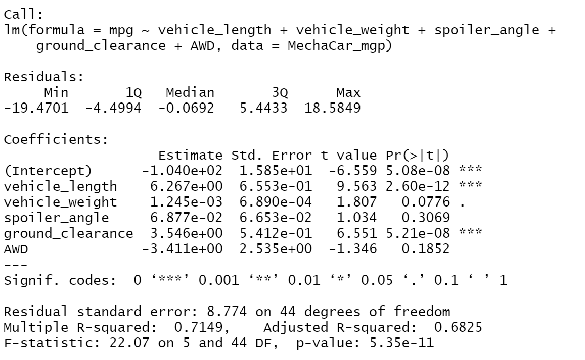
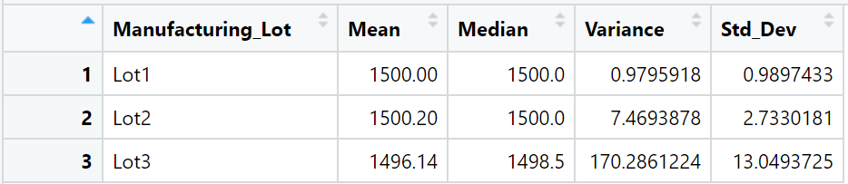
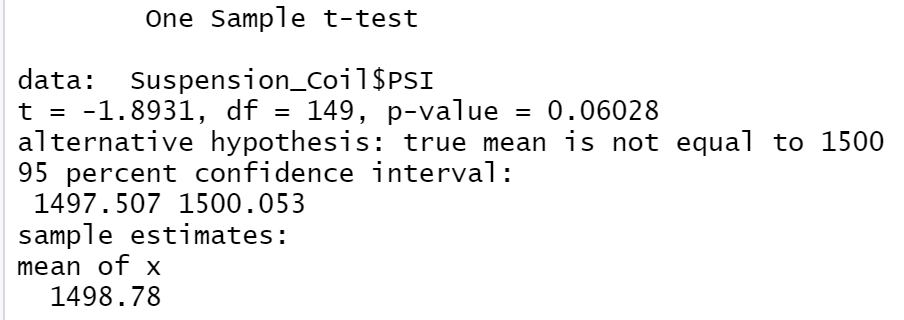
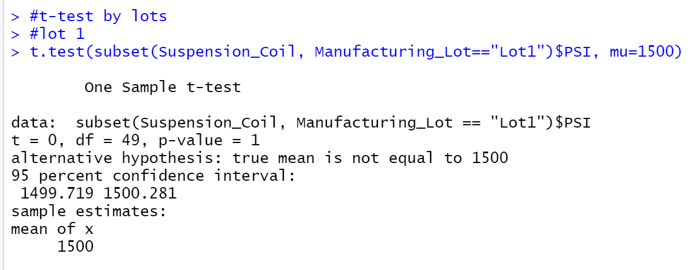
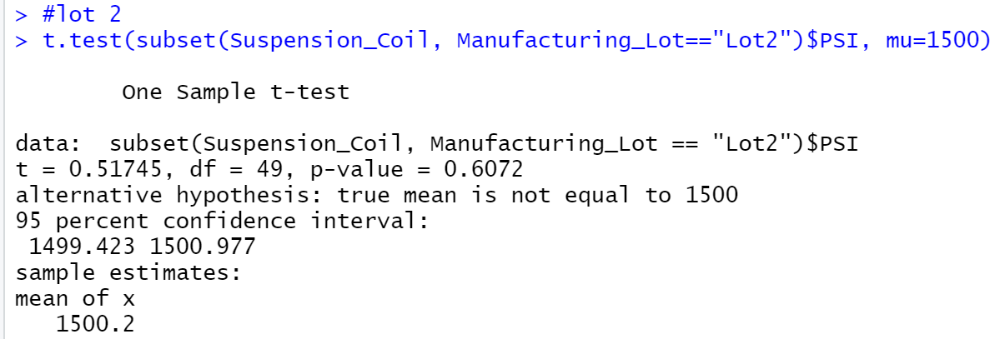
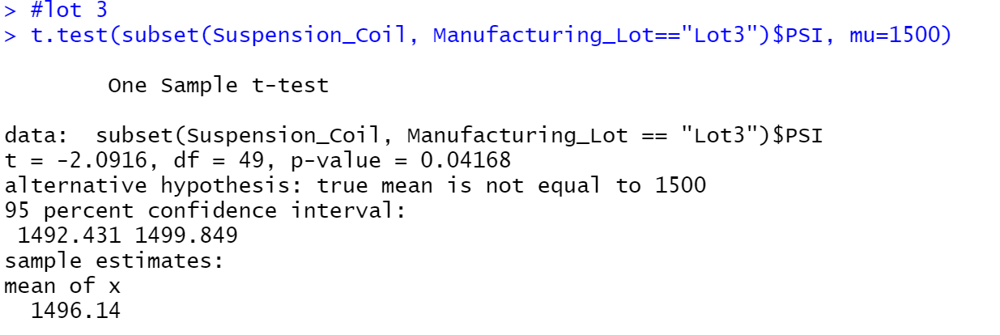

# Mechacar_statistical_analysis
R and its statistical test capabilities

### Background
A few weeks after starting his new role, Jeremy is approached by upper management about a special project. AutosRUs’ newest prototype, the MechaCar, is suffering from production troubles that are blocking the manufacturing team’s progress. AutosRUs’ upper management has called on Jeremy and the data analytics team to review the production data for insights that may help the manufacturing team.

1. Deliverable 1: Linear Regresstion to Predict MPG: Perform multiple linear regression analysis to identify which variables in the dataset predict the mpg of MechaCar prototypes

    

Q1. Which variables/coefficients provided a non-random amount of variance to the mpg values in the dataset?
-Methodology: Each Pr(>|t|) value in the summary (above) represents the probability that each coefficient contributes a random amount of variance to the linear model.

-A1. Using the MechaCar_mpg dataset, vehicle_length and ground clearance(as well as intercept) are statistically unlikely to provide random amounts of variance to the linear model. In other words the **vehicle_length and ground_clearance have a significant impact on mpg**.

-Q2. Is the slope of the linear model considered to be zero? Why or why not?

 Methodology: Examine the Pr(>|t|) value in the summary above for the Intercept.

-A2.**The intercept is statistically significant** (less than the 0.05) **and not zero**. This would indicate that the intercept explains a significant amount of variability in the dependent variable when all independent variables are equal to zero. It could mean that the significant features (such as vehicle_weigh and ground_clearance) may need scaling or transforming to help improve the predictive power of the model; or there are other variables that can help explain the variability of our dependent variable(mpg) that have not been included in our model.

-Q3. Does this linear model predict mpg of MechaCar prototypes effectively? Why or Why not?

-Methodology: Examine the Multiple R-squared value to indicate how well the regression model approximates real-world data points. In most cases, the value will range between 0 and 1 and can be used as a probability metric to determine the likelihood that future data points will fit the model.

-A3: The **Multiple R-squared value is 0.71**(while the p-value remained significant(very small)**indicting the model does an adequate job of predicting mpg**)

2. Deliverable 2: Summary Statistics on Suspension Coils: Collect summary statistics on the pounds per square inch (PSI) of the suspension coils from the manufacturing lots

Q1.The design specifications for the MechaCar suspension coils dictate that the variance of the suspension coils must not exceed 100 pounds per square inch. Does the current manufacturing data meet this design specification for all manufacturing lots in total and each lot individually? Why or why not?

-Methodology: Examine the mean, median, and variabce in total (total_summary) and for each lot (lot_summary) to determine if the variance is within the 100 pounds per square inch.

-A1: **In total the specification are met with variance of 62.29(less than 100)**.

-A2: **By lots, Lots 1 and 2 are within specifications; however lot 3 has a variance that exceeds specifications(100 PSI)**

3. Deliverable 3: T-Test on Suspension Coils: Run t-tests to determine if the manufacturing lots are statistically different from the mean population

Q1. Are all manufacturing lots(and each lot individually) statistically different from the population mean of 1,500 pounds per square inch.

Methodology (all manufacturing lots): Perform a t.test using PSI and mu of 1500 and evaluate the resulting P-value for significance using a 0.5 level of significance.

**All lots are NOT significantly different from the population mean(with a p-value of 0.060)**

Methodology (by lots using subsets): Perform a t.test using subsets to examine the resulting p-value for significance.

**Lot 1 is NOT significantly different from the population mean (with a p-value of 1)**

**Lot 2 is NOT significantly different from the population mean(with a p-value of 0.61)**

**Lot 3 IS significantly different from the population mean (with a p-value of 0.042)**

4. Deliverable 4: Design a Study Comparing the MechaCar to the Competition Design: 

An additional metric(not in the MechaCar_mpg dataset) is horsepower (or a surrogate measure like engine size or number of cylinders). Manufactors often note a smaller engine size (8 vs. 6 vs. 4) result in improved mpg.

The null hypothesis would be there is no statistical difference while the Alternative hypothesis would be there is a difference.
